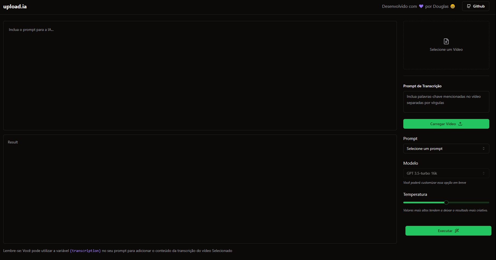
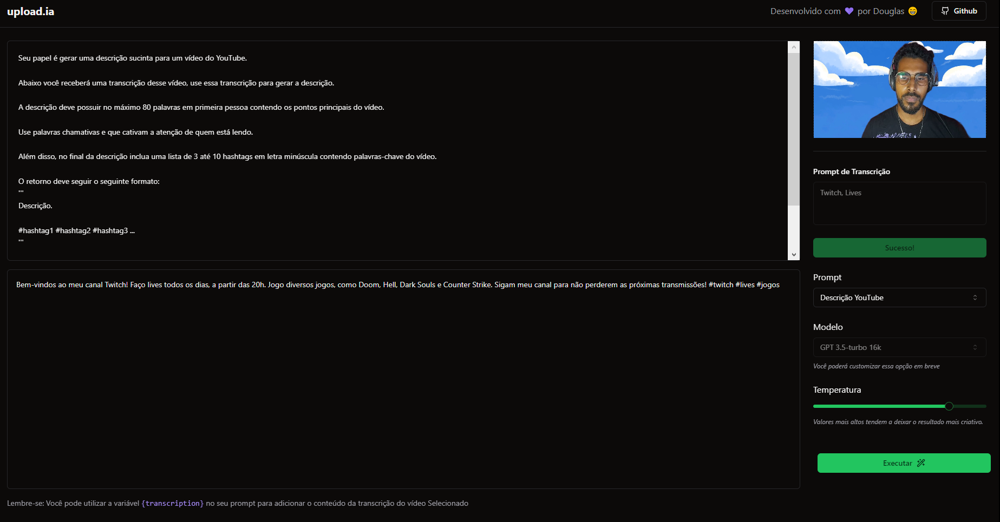

<h1 align="center">Discription AI Generator</h1>

 <a href="#Descrição">Descrição</a> •
 <a href="#Tecnologias">Tecnologias</a> • 
 <a href="#Lembretes">Licença</a> • 
 <a href="#Notas do Desenvolvedor">Autor</a>

## 🎈 Descrição 🎈
O AI é uma plataforma que utiliza o áudio de um video para gerar um prompt para o ChatGPT, gerar uma descrição ou um título para o vídeo carregado, o prompt pode ser alterado conforme a preferência do usuário.

## 🔗 Tecnologias 🔗
Para realizar esse projeto foi utilizado as seguintes tecnologias:

Typescript

React

Next.js

Node.js

OpenAI

Tailwind Css

Vercel AI SDK

Git e Github

## 👀 Lembretes 👀
O projeto funciona em `LocalHost`. 

Lembre-se de checar se o pacote `node` está instalado em seu computador: 
Abra o `CMD` na pasta do projeto ('\NLW - AI PROJECT\upload-ai-api') e digite o seguinte comando 'npm run dev', em seguida abra a pasta '\NLW - AI PROJECT'  e digite 'npm run dev' após carregar pressione a tecla "O" para abrir no navegador.
prontinho 😁 o site estará funcionando. e rodando perfeitamente.

## 🚧 Status do projeto 🚧
Projeto Finalizado (mas sempre podemos melhorar :D)

## 📸Imagens do Projeto 📸

<h1 align="center">Informações do Dev 😁💻</h1>

<a href="https://black598.github.io/Portifolio/">Portifolio</a> •
<a href="https://twitter.com/BlackG598">Twitter</a> •
<a href="https://github.com/Black598">GitHub</a> •
<a href="https://www.linkedin.com/in/douglas-ferreira-dev/">Linkedin</a>

